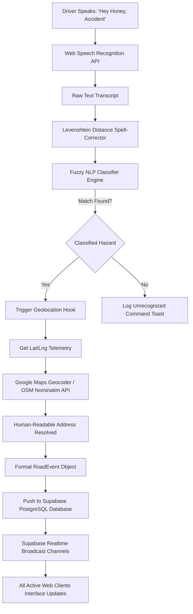
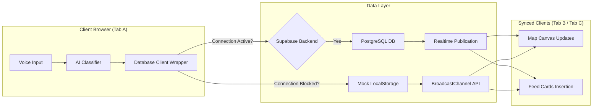
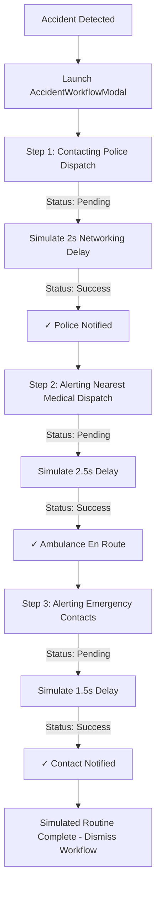

# Hey Honey - AI-Powered Road Safety Assistant

Hey Honey is a modern, real-time road safety web application that allows drivers to report road hazards hands-free using natural voice commands. The application utilizes client-side AI parsing to classify hazard types, captures the user's GPS coordinates, reverse-geocodes locations into human-readable addresses, and syncs events to a live community map and feed.

This dashboard UI is designed as a premium SaaS-style interface inspired by Tesla dashboard displays, Linear, and Vercel.

---

## 📊 System Architecture & Data Workflows

Below are interactive flowcharts and architectural diagrams describing how **Hey Honey** processes telemetry, speech recognition, and database synchronizations.

### 1. Hands-Free Voice Reporting Workflow
This flowchart describes how a driver's vocal report is processed, cleaned, classified, geocoded, and pushed to the cloud in real-time.



### 2. Multi-Tab Database Synchronization
This diagram illustrates the dual-mode synchronization layer: connecting directly to Supabase Realtime Channels or falling back automatically to local multi-tab broadcast storage.



### 3. Accident Emergency Dispatch Workflow
When an accident is reported, a specialized checklist tracks simulated dispatch state:



---

## 🚀 Key Features

- 🎙️ **Hands-free AI Voice Reporting:** Speak commands like *"Hey Honey, Accident"* or *"Hey Honey, Water"* to submit a report without touching your screen.
- 📡 **Nearby Hazard Radar:** Automatically scans, calculates, and lists hazards around the driver's current position, sorted by nearest distance.
- 🗺️ **Full-height Interactive Map:** Fills the left screen area containing floating overlays: centered glowing microphone button, small AI status badge, zoom/locate controls, and bottom legend.
- 🔄 **Real-Time Synchronization:** Seamless cross-client updates using Supabase Realtime (with multi-tab local broadcast syncing as an instant offline fallback).
- 🚑 **Simulated Accident Workflow:** When an accident is reported, a simulated emergency checklist runs (✓ Police Notified, ✓ Ambulance Notified, ✓ Emergency Contact Notified).
- 💻 **Offline Simulator Map:** If Google Maps fails to load or internet is disconnected, the app launches a vector-grid map simulator where you can click to simulate reporting hazards.

---

## 🛠️ Tech Stack

- **Frontend:** React 19, TypeScript, Vite, Tailwind CSS v4, Lucide Icons
- **Database & Realtime:** Supabase JS SDK (PostgreSQL & Realtime Channels)
- **Mapping:** Google Maps JavaScript API (Direct Integration)
- **Voice Recognition:** Web Speech Recognition API + Client-side NLP parser

---

## 📁 Folder Structure

```text
Safetyproject/
├── index.html                  # HTML template with Google Fonts & Map viewport
├── tailwind.config.js          # Tailwind theme configurations and custom keyframes
├── postcss.config.js           # PostCSS configuration for CSS compilation
├── vite.config.ts              # Vite TS settings
├── src/
│   ├── main.tsx                # StrictMode app mounter
│   ├── index.css               # Base Tailwind, scrollbar styling, glassmorphism UI classes
│   ├── App.tsx                 # Main layout coordinator, responsive grid/tab switchers, state
│   ├── types/
│   │   └── index.ts            # RoadEvent, HazardType, LocationState, SpeechState interfaces
│   ├── hooks/
│   │   ├── useGeolocation.ts   # Real-time watch state GPS trackers & fallbacks
│   │   └── useSpeechRecognition.ts # Browser Speech API wrapper, triggers, & reconnects
│   ├── components/
│   │   ├── MapContainer.tsx    # Google Maps wrappers & offline simulators
│   │   ├── CommunityFeed.tsx   # Premium expandable feed lists
│   │   ├── NearbyRadar.tsx     # Sonar sweep radar scanners
│   │   ├── VoiceController.tsx # Pulsing floating mic overlay controllers
│   │   ├── StatusCard.tsx      # High-tech system configuration checklists
│   │   ├── NotificationToast.tsx # OS-style spring-animated glass alert popups
│   │   └── AccidentWorkflowModal.tsx # Emergency dispatch checklists
│   ├── services/
│   │   └── aiClassifier.ts     # NLP classifier, trigger matching, fuzzy keywords, Levenshtein distance
│   ├── supabase/
│   │   └── config.ts           # Supabase client config & fallback Mock DB localStorage system
│   ├── utils/
│   │   ├── distance.ts         # Haversine distance calculators and distance formatters
│   │   └── geocode.ts          # Google Maps geocoder / OSM Nominatim API reverse geocoders
```

---

## ⚙️ Supabase Database Setup

To configure Supabase, create a table named `road_events` in your Supabase SQL Editor:

```sql
-- 1. Create the road_events table
create table public.road_events (
  id uuid default gen_random_uuid() primary key,
  event_type varchar(50) not null,
  latitude double precision not null,
  longitude double precision not null,
  address text,
  reported_by varchar(100) default 'Driver (Voice)',
  status varchar(50) default 'active',
  created_at timestamp with time zone default timezone('utc'::text, now()) not null
);

-- 2. Enable Realtime on the table to receive instant changes
alter publication supabase_realtime add table road_events;

-- 3. Set up Row Level Security (RLS) policies for anonymous guest writes/reads (MVP style)
alter table public.road_events enable row level security;

create policy "Allow public read access" 
  on public.road_events for select 
  using (true);

create policy "Allow public write access" 
  on public.road_events for insert 
  with check (true);
```

---

## 🔑 Environment Variables

Create a `.env` file in the root directory:

```env
# Supabase Configuration
VITE_SUPABASE_URL=your-supabase-project-url
VITE_SUPABASE_ANON_KEY=your-supabase-anon-key

# Google Maps Configuration
VITE_GOOGLE_MAPS_API_KEY=your-google-maps-javascript-api-key
```

*Note: If these environment variables are missing or empty, the application will automatically enter **Mock Mode** using local storage syncing across browser tabs and launching the vector offline simulator map.*

---

## 📥 Installation & Running Locally

Ensure you have Node.js (LTS version) installed.

1. **Install dependencies:**
   ```bash
   npm install
   ```

2. **Run the developer environment:**
   ```bash
   npm run dev
   ```
   Open `http://localhost:5173` in your browser. Use Google Chrome, Microsoft Edge, or Safari for voice commands.

3. **Compile a production bundle:**
   ```bash
   npm run build
   ```
